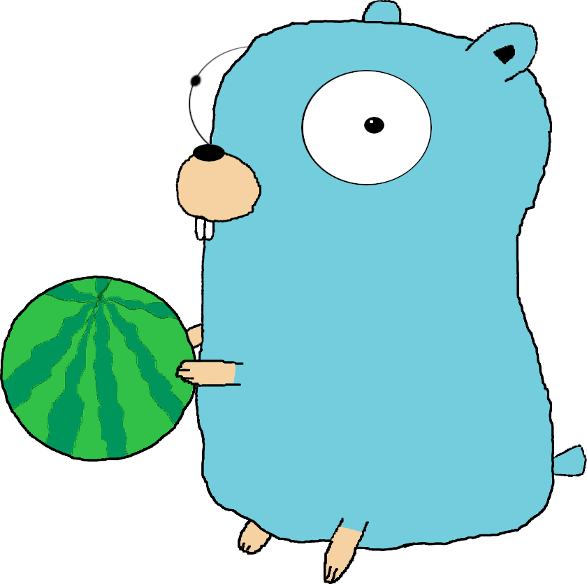

<h1>Go Watermelon</h1>

A bundle of services written in Go to provide a mailing of watermelon images.

## About
My pet project created for learning and fun. Here I used a lot of technologies, such as:
- **API**
    - gRPC (Golang implementation [grpc-go](https://github.com/grpc/grpc-go)
    - [gRPC-Gateway](https://github.com/grpc-ecosystem/grpc-gateway)
- **DB**
    - Redis with [go-redis client](https://github.com/go-redis/redis)
    - PostgreSQL with [Go driver pq](https://github.com/lib/pq)
    - Clickhouse
- **Message brokers**
    - Apache Kafka with [sarama library](https://github.com/Shopify/sarama)
- **Logging**
    - [Zerolog](https://github.com/rs/zerolog)
- **Testing**
    - [Testify](https://github.com/stretchr/testify). I used two packages from it:
        - [Assert](https://github.com/stretchr/testify/assert)
        - [Mock](https://github.com/stretchr/testify/mock)
    - [go-sqlmock](https://github.com/DATA-DOG/go_sqlmock)
    - [redismock](https://github.com/go-redis/redismock)
    - Sarama package [mocks](https://github.com/Shopify/sarama/mocks)
- **Email (SMTP)**
    - [go-simple-mail](https://github.com/xhit/go-simple-mail)
- **Containerization**
    - Docker
    - Docker Compose

## How does it work
The project architecture is following:

It based on gRPC and defined service (in internal/user\_handling/proto/users.proto) UserHandling.
UserHandling has 4 methods to be called:
- AddUser: insert a record about user with given nickname and email into database.
- DeleteUser: delete a record about user with given nickname.
- AuthUser: actually, when 2 latter method are called, no changes occur in the database. Instead, a record of to-be operation is written in cache. When AuthUser executes, it checks for record with given key and applies specified method in it.
- ListUsers: returns a list of all users stored in database.

There are three services in this project:
- ### Main service
Implements UserHandling service and also manages data resources(PostgreSQL database and Redis cache). It executed called procedures and sends messages with Kafka to email service, if necessary. When the chosen delivery time comes(first time) or delivery interval passes, it sends request to the email service to send a daily message.

- ### Main service proxy
Simply translates HTTP requests into gRPC.

- ### Email service
Manages mailing. When there is a request from the main service, it sends a message (auth or daily) using given email address over SMTP. Sending a daily message, the service also selects a random image of watermelons. 

Besides, both main and email services write logs using Zerolog. Besides stderr writing, logger also produces log messages for Kafka, which are consumed by Clickhouse and stored.

## How to run
We can run all necessary services separately, but there is a better and simplier way to do it - use Docker and Docker Compose. To run the project:
- **Create services images**. Dockerfiles for the services are already here, so just create images with "docker build" command or use Make target "create\_images".
- **Create and run containers**. Use "docker-compose up" or Make target "containers\_up".

Need to say, you can specify the delivery time or interval. To do it, define environment variables "GWM\_DELIVERY\_TIME" and "GWM\_DELIVERY\_INTERVAL" respectively. GWM\_DELIVERY\_TIME must match format "HH:MM:SS". GWM\_DELIVERY\_INTERVAL must match Golang time.Duration string, i.e. decimal numbers with optional fraction followed by a unit suffix (e.g. 5h, 30m). The environment variables are already in Make target "containers\_up", so you can reassign them in Makefile.

Because the email service references the main one, you also can set the host location of main service with variable GWM\_HOST\_EXTERNAL\_IP.

