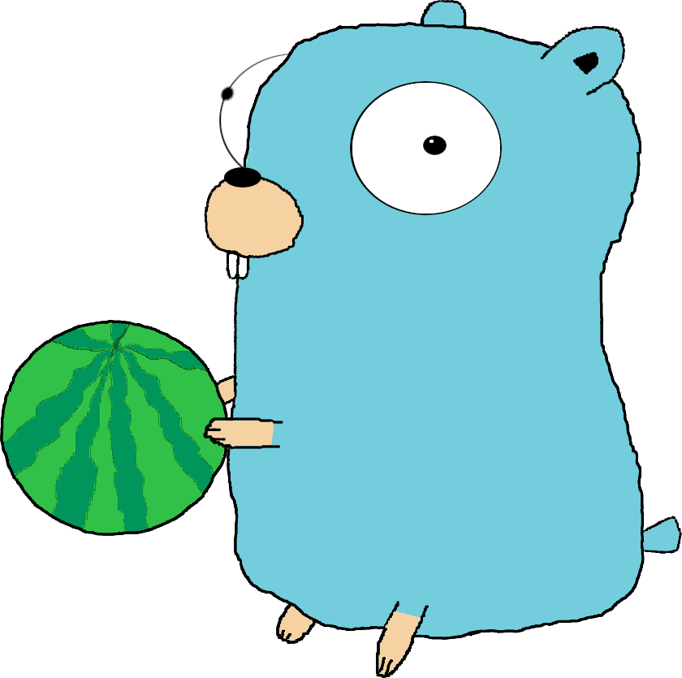
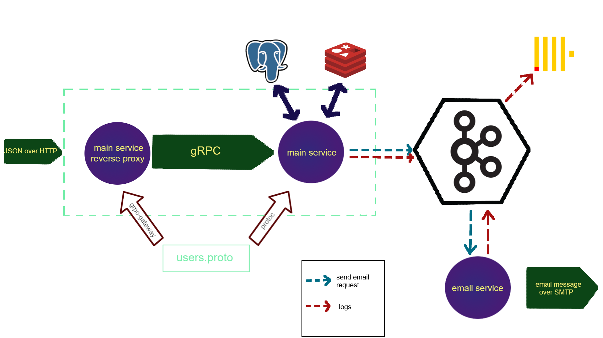

<h1>Go Watermelon</h1>

Набор сервисов на Go для отправки изображений арбузов по почте.

## О проекте
Это мой пет-проект, созданный чисто ради обучения и веселья. В нем я использовал разные технологии, вроде
- **API**
    - gRPC (Реализация на Go [grpc-go](https://github.com/grpc/grpc-go))
    - [gRPC-Gateway](https://github.com/grpc-ecosystem/grpc-gateway)
- **Базы данных**
    - Redis с помощью клиента [go-redis](https://github.com/go-redis/redis)
    - PostgreSQL с драйвером [pq](https://github.com/lib/pq)
    - Clickhouse
- **Брокеры сообщений**
    - Apache Kafka с библиотекой [sarama](https://github.com/Shopify/sarama)
- **Логирование**
    - [Zerolog](https://github.com/rs/zerolog)
- **Тестирование**
    - [Testify](https://github.com/stretchr/testify). Оттуда я использовал два пакета:
        - [Assert](https://github.com/stretchr/testify/assert)
        - [Mock](https://github.com/stretchr/testify/mock)
    - [go-sqlmock](https://github.com/DATA-DOG/go_sqlmock)
    - [redismock](https://github.com/go-redis/redismock)
    - Пакет из sarama [mocks](https://github.com/Shopify/sarama/mocks)
- **Email (SMTP)**
    - [go-simple-mail](https://github.com/xhit/go-simple-mail)
- **Контейнеризация**
    - Docker
    - Docker Compose

## Как он работает
Проект имеет следующую архитектуру:

Он основан на gRPC и определенном мною сервисе (в файле internal/user\_handling/proto/users.proto) UserHandling.
UserHandling имеет 4 метода для вызова:
- AddUser: добавляет запись о пользователе с заданными никнеймом и почтой в базу данных. 
- DeleteUser: удаляет запись о пользователе с заданным никнеймом. 
- AuthUser: на самом деле, предыдущие два метода никак не меняют информацию в базе данных. Вместо этого запись о запрошенной операции добавляется в кэш. Когда вызывается AuthUser, он проверяет наличие подобной записи с заданным ключом и затем исполняет определенный в записи метод. 
- ListUsers: возвращает список всех пользователей, записанных в базе данных. 

В проекте определено три сервиса:
- ### Главный сервис 
Он реализует gRPC сервис UserHandling, а также управляет ресурсами данных (базой данных PostgreSQL и кэшем Redis). Он исполняет вызванные процедуры и отправляет сообщения почтовому сервису через Kafka в случае необходимости. Когда приходит время отправки ежедневных сообщений (в первый раз) или проходит заданный интервал, главный сервис отправляет запрос на отправку сообщений для каждого пользователя почтовому сервису.

- ### Прокси главного сервиса 
Просто-напросто транслирует HTTP-запросы в gRPC.

- ### Почтовый сервис
Управляет отправкой писем. Когда от главного сервиса поступает запрос, почтовый сервис отправляет сообщение (аутентификационное или ежедневное) по заданному адресу с помощью протокола SMTP. Во время отправки ежедневных сообщений, этот сервис также выбирает случайное изображение арбуза.

Помимо всего прочего, главный и почтовый сервисы записывают логи с использованием Zerolog. 
Besides, both main and email services write logs using Zerolog. Кроме записи логов в stderr, логгер также создает сообщения в Kafka, которые принимает и хранит Clickhouse. 

## Как запустить проект 
Можно запустить все необходимые сервисы раздельно, но лучше и проще сделать это с помощью Docker и Docker Compose. Для запуска проекта:
- **Создайте образы сервисов**. Для каждого сервиса уже заготовлены Docker-файлы, так что просто создайте образы командой "docker build" или с использованием цели Make "create\_images".
- **Создайте и запустите контейнеры**. Запустите "docker-compose up" или Make-цель "containers\_up".

Стоит упомянуть, что можно определить время и интервал отправки сообщений. Для этого нужно определить переменные окружения "GWM\_DELIVERY\_TIME" и "GWM\_DELIVERY\_INTERVAL" соответственно. GWM\_DELIVERY\_TIME должна соотвествовать формату "ЧЧ:ММ:СС". GWM\_DELIVERY\_INTERVAL должна соотвествовать строковому представлению time.Duration из пакета time языка Go, то есть представлять собой набор десятичных чисел с опциональной дробной частью с суффиксом единицы времени (пример: 5h или 30m). Переменные уже определены в цели "containers\_up" и их можно переопределить в Makefile.

Поскольку почтовый сервис ссылается на главный, также можно определить адрес главного сервиса в переменной GWM\_HOST\_EXTERNAL\_IP.
